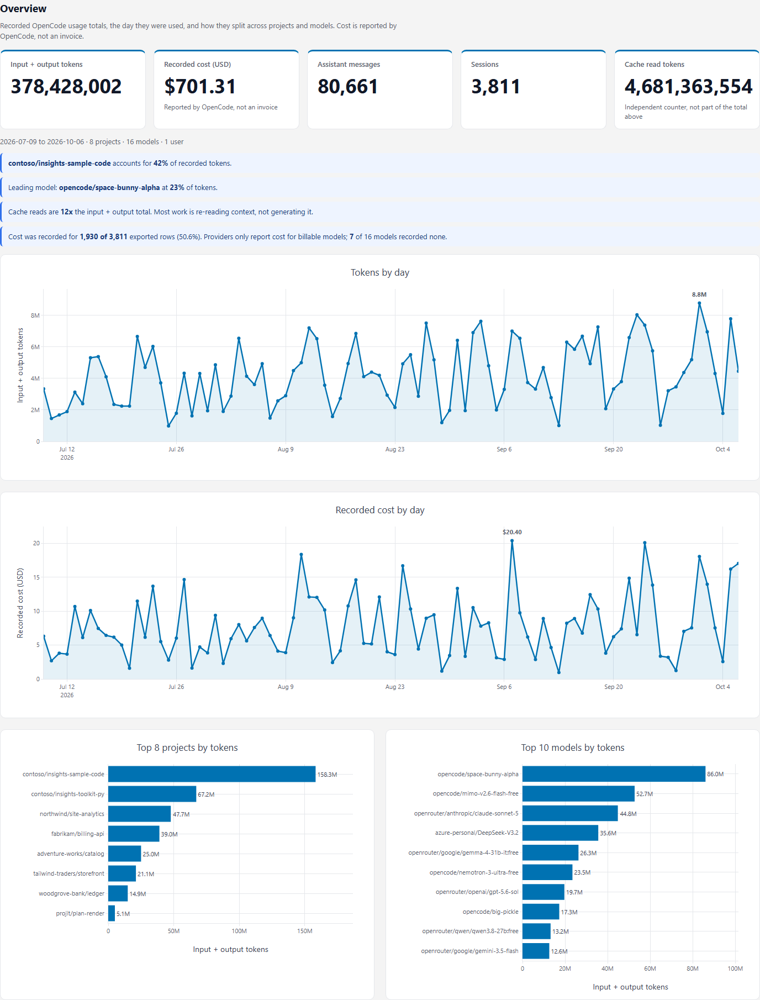
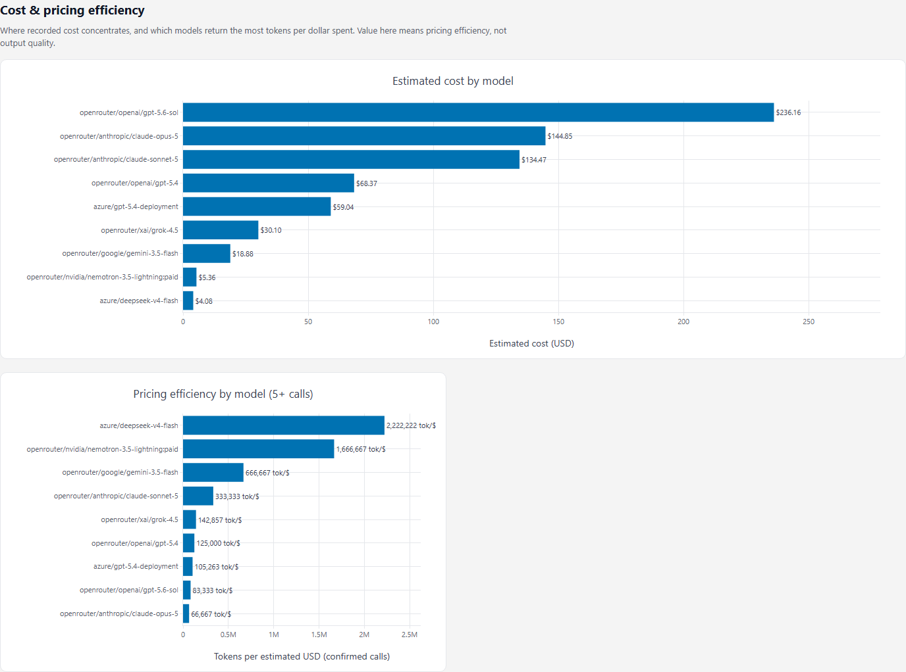
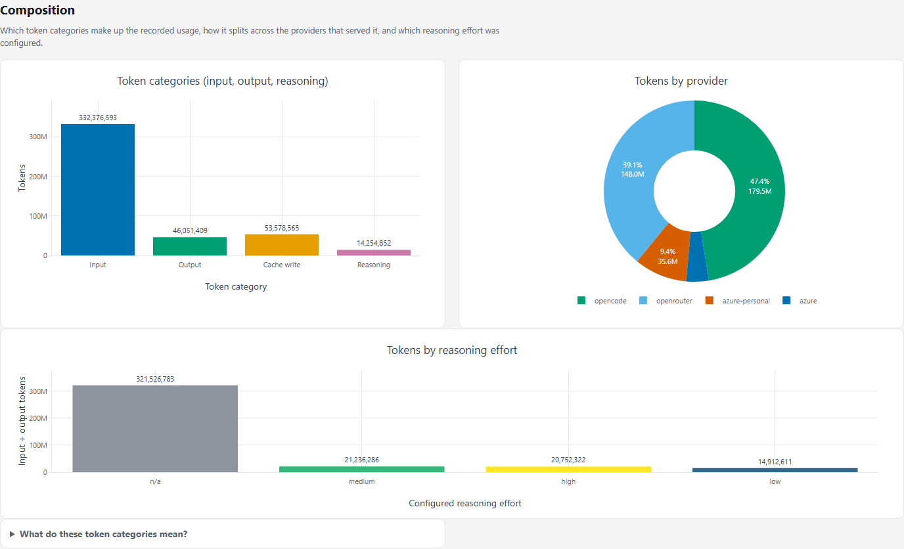
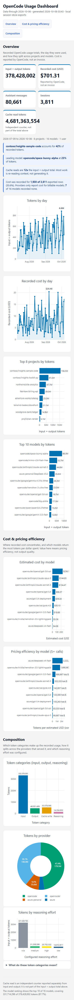

# OpenCode Usage Dashboard

A local, read-only tool for exporting usage recorded by OpenCode and exploring
tokens, cost, projects, providers, and models in a self-contained HTML dashboard.

The exporter reads OpenCode's local SQLite database. Its schema is an
implementation detail and can change between releases. The exporter validates
the tables and columns it needs and reports incompatible schemas rather than
silently producing incomplete data.

## Quick start

Requirements: Python 3.9 or later and OpenCode session data on this machine.

```powershell
python -m pip install -r requirements.txt
python extract_usage.py
python dashboard.py --in "opencode_usage_*.csv" --out usage_dashboard.html
```

Open `usage_dashboard.html` in a browser. The exporter discovers the default
database location when possible. Pass `--db` to select a custom location:

```powershell
python extract_usage.py --db "C:\path\to\opencode.db"
```

Use `--include-session-title` only when you want free-text session titles in
the CSV and dashboard. Titles can contain sensitive project or task details.

## Screenshots

All screenshots are generated from synthetic data produced by
[`tools/make_sample_data.py`](tools/make_sample_data.py) — 90 days, eight
projects, sixteen models, and a deliberate mix of free and paid models so the
cost and pricing-efficiency sections have something to rank. **No real usage
data appears here.**



<details>
<summary>More screenshots</summary>

Cost and pricing efficiency, shown only when enough models actually carry
recorded cost:



Token categories, provider mix and reasoning effort:



The whole page at mobile width:



</details>

Regenerate them after changing the dashboard layout:

```powershell
python tools/make_sample_data.py --out sample_usage.csv
python dashboard.py --in sample_usage.csv --out sample_dashboard.html
python tools/make_screenshots.py --html sample_dashboard.html --out-dir docs/images
```

## Metrics

The export uses one row per session, day, provider, model, and variant.
`total_tokens` is input plus output tokens, matching the definition used by the
Copilot CLI Usage Dashboard. Reasoning and cache tokens remain separate
counters and are not added to that headline total. Cost is the amount recorded
by OpenCode, not a recalculated estimate or an invoice.

When multiple CSVs contain the same session/model/day, the dashboard keeps the
row from the latest export timestamp and warns that it found overlapping
records. This avoids adding repeated snapshots of the same local history.

Provider is OpenCode's provider ID. Model is stored as `provider/model` so
models with the same name from different providers remain distinct. Project
names are reduced to the last directory segment to avoid exporting full local
paths.

## Privacy

The database is opened read-only and copied to a temporary SQLite snapshot
before extraction so the live OpenCode process is not modified or locked for
the duration of the read. The CSV and generated HTML can contain usernames,
project names, model names, dates, and optional session titles. Review files
before sharing them. Generated data files are excluded by `.gitignore`.

## Limitations

- OpenCode's local database schema is not a stable public API. Check
  [Compatibility](docs/compatibility.md) when OpenCode changes.
- Reported costs depend on the provider and pricing information available to
  OpenCode. The dashboard displays recorded cost and does not imply that it
  equals a provider invoice.
- Provider IDs identify the provider configured in OpenCode, which may be a
  gateway or service rather than the model vendor.
- The headline token total is deliberately input plus output. Compare cache
  and reasoning totals separately.

## Development

```powershell
python -m pip install -r requirements.txt -r requirements-dev.txt
python -m pytest
```

Most tests are plain unit tests. `tests/test_dashboard_ux.py` additionally
drives the generated dashboard in a real browser, and skips itself when
Playwright is unavailable:

```powershell
python -m pip install playwright
playwright install chromium
python -m pytest tests/test_dashboard_ux.py -q
```

### Sample data

A real export is usually too small to exercise the dashboard: a few days of
history, and no recorded cost for free-tier models, leave the cost and
reasoning-effort sections with nothing to show. `tools/make_sample_data.py`
generates a deterministic synthetic export with the same schema, 90 days of
history, and a deliberate mix of free and paid models.

It is seeded, so repeated runs produce byte-identical output. Project names use
the fictitious companies Microsoft uses in documentation, so no real project
name can reach a published screenshot.

```powershell
python tools/make_sample_data.py --out sample_usage.csv
python dashboard.py --in sample_usage.csv --out sample_dashboard.html
```

### Screenshots

```powershell
python tools/make_screenshots.py --html sample_dashboard.html --out-dir docs/images
```

Captures each section at desktop and mobile widths. Regenerate after changing
the dashboard layout. Requires the Playwright install above.

## Attribution

This project began as an adaptation of
[microsoft/ghc-cli-dashboard](https://github.com/microsoft/ghc-cli-dashboard),
the Copilot CLI usage dashboard, which is also MIT licensed. The two-file
shape of the tool — a SQLite extractor that writes a CSV, and a renderer that
turns one or more exports into a self-contained HTML page — comes from there,
as does the `total_tokens` definition (input plus output, with reasoning and
cache counters kept separate) and the export/overlap handling.

Substantial parts of that original remain, including `extract_usage.py`,
`dashboard.py` and the test suite. This fork changes the data source to
OpenCode's local store, and replaces the rendering layer, chart palette and
section layout. Microsoft Corporation's copyright is retained in `LICENSE`
and in the headers of the derived files, as the MIT licence requires.

## Licence

MIT. See [LICENSE](LICENSE).
